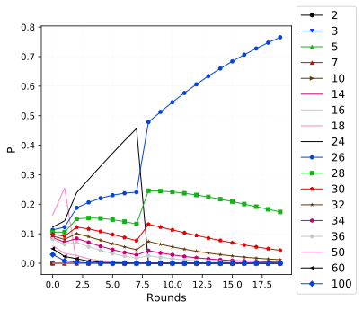
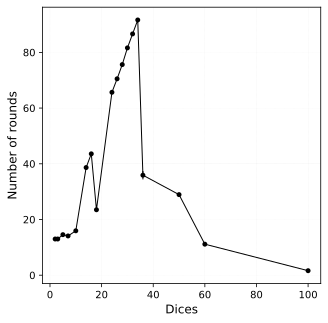

# Bayesian inference

Soit un sac de dés, un complice tire un dé du sac et réalise des lancers derniers à l'abri des regards. À chaque lancer, il énonce le chiffre donné par le dé. À partir des chiffres énoncés, l'expérimentateur doit déterminer quel dé est utilisé en un minium de lancer.

## Dynamic on an experiment (with Dice 26)

  

## Convergence time

  

