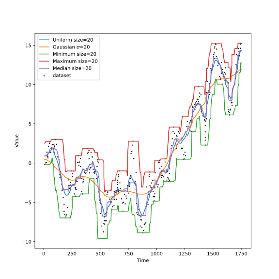

# Application de filtre

## Sur une marche aléatoire

    

## Voir 

* http://www.xavierdupre.fr/app/ensae_teaching_cs/helpsphinx/td_2a.html
* https://github.com/rlabbe/Kalman-and-Bayesian-Filters-in-Python
