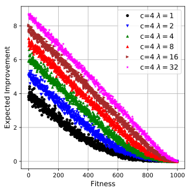
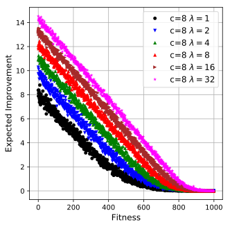
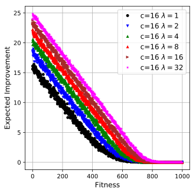
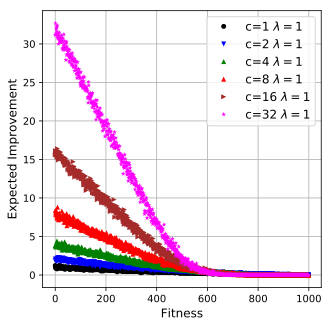
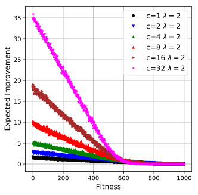
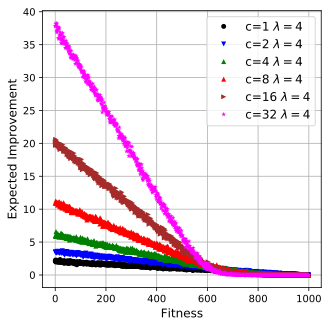
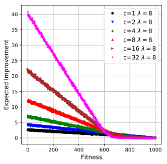
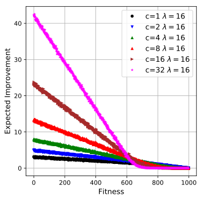

* mutation operator : flipbit with parameter c
* Algo : (1 + lambda)-ES
* Problem : Onemax N=1000

<TABLE border="0" align="center" style="margin: 0px auto;">
	<TR>
		<TD>
		

  			
		

		</TD> 
		<TD>
		

  			
		
		
		</TD> 
	</TR>
	<TR>
		<TD>
		

  			
		

		</TD> 
		<TD>
		

  			
		
		
		</TD> 
	</TR>
	<TR>
		<TD>
		

  			
		

		</TD> 
		<TD>
		

  			
		
		
		</TD> 
	</TR>
</TABLE>

<TABLE border="0" align="center" style="margin: 0px auto;">
	<TR>
		<TD>
		

  			
		

		</TD> 
		<TD>
		

  			
		
		
		</TD> 
	</TR>
	<TR>
		<TD>
		

  			
		

		</TD> 
		<TD>
		

  			
		
		
		</TD> 
	</TR>
	<TR>
		<TD>
		

  			
		

		</TD> 
		<TD>
		

  			
		
		
		</TD> 
	</TR>
</TABLE>
