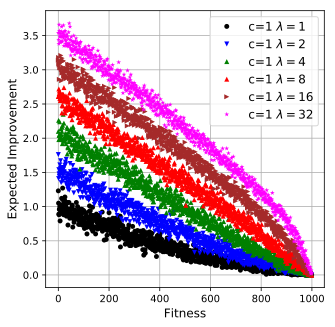

<TABLE border="0" align="center" style="margin: 0px auto;">
	<TR>
		<TD>
		

  			
		

		</TD> 
		<TD>
		

  			
		
		
		</TD> 
	</TR>
	<TR>
		<TD>D</TD> 
		<TD>E</TD>
	</TR>
	<TR>
		<TD>D</TD> 
		<TD>E</TD>
	</TR>
</TABLE>
