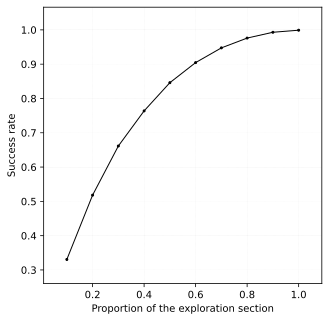

# Arrêt optimal

Soit une liste de nombres à inconnue à Aladin. Aladin peut seulement les visiter de manière itérative. Il doit déterminer le plus grand nombre, celui dernièrement considère, en un nombre de visites minimum.

  

