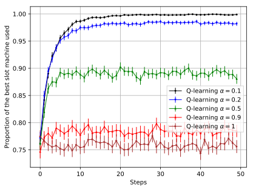

# Q-learning with two slot machines.

The method must choose between two slot machines with a stationary performance different follow a normal law : M1 = N(0, 1) and M2 = N(1, 1). In abscissa nombre of step and in ordinate is the proportion of use of the best operator on 10000 experiments. With y = 0 the M1 is used 100% and y = 1 is used 100% on 10000 experiments at the step i.

  

