<TABLE BORDER="1"> 
  <CAPTION> Automate cellulaire 1D avec deux états </CAPTION> 
  <TR> 
 <TH> Numéro de la règle </TH> 
 <TH> Grain une cellule </TH> 
 <TH> Grain aléatoire </TH> 
  </TR> 
<TR>
<TH> Règle &#8470;0</TH>
<TD></TD>
<TD></TD>

</TR>
<TR>
<TH> Règle &#8470;1</TH>
<TD></TD>
<TD>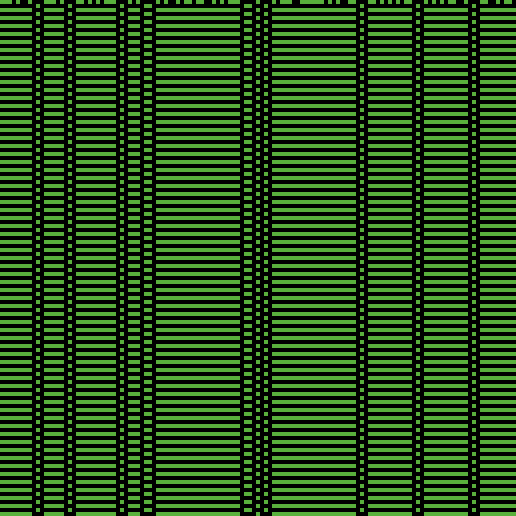</TD>

</TR>
<TR>
<TH> Règle &#8470;2</TH>
<TD></TD>
<TD></TD>

</TR>
<TR>
<TH> Règle &#8470;3</TH>
<TD>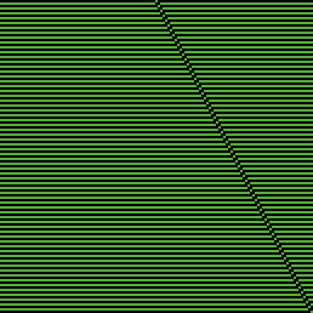</TD>
<TD></TD>

</TR>
<TR>
<TH> Règle &#8470;4</TH>
<TD></TD>
<TD></TD>

</TR>
<TR>
<TH> Règle &#8470;5</TH>
<TD>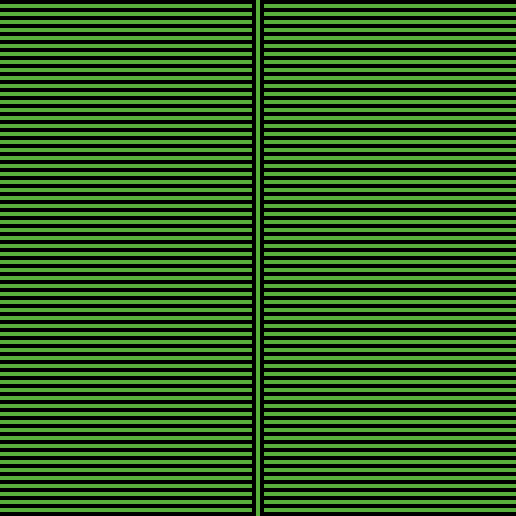</TD>
<TD>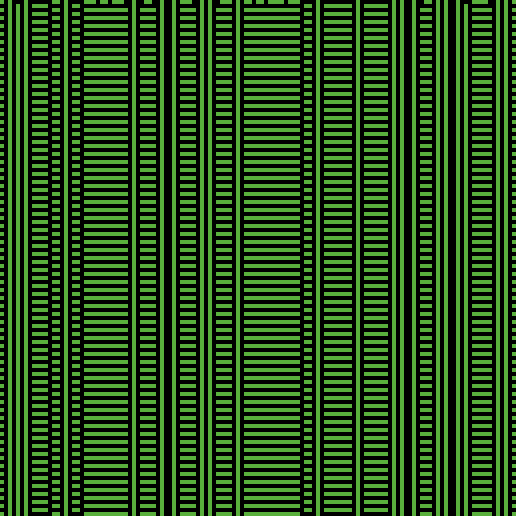</TD>

</TR>
<TR>
<TH> Règle &#8470;6</TH>
<TD></TD>
<TD>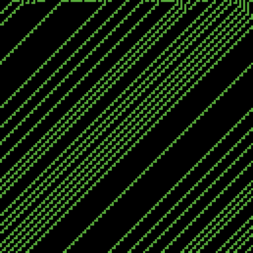</TD>

</TR>
<TR>
<TH> Règle &#8470;7</TH>
<TD>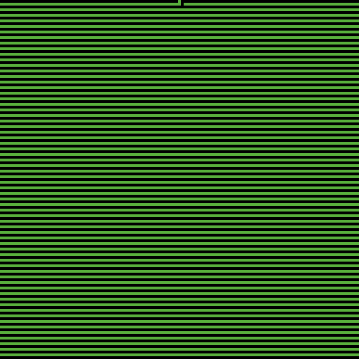</TD>
<TD>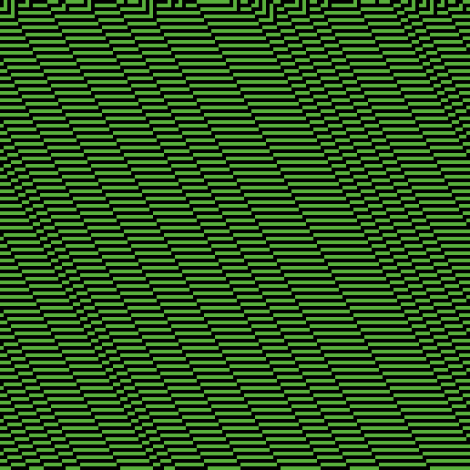</TD>

</TR>
<TR>
<TH> Règle &#8470;8</TH>
<TD></TD>
<TD></TD>

</TR>
<TR>
<TH> Règle &#8470;9</TH>
<TD></TD>
<TD>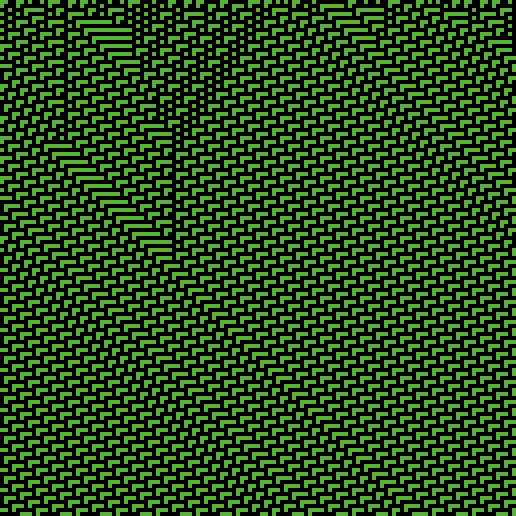</TD>

</TR>
<TR>
<TH> Règle &#8470;10</TH>
<TD></TD>
<TD></TD>

</TR>
<TR>
<TH> Règle &#8470;11</TH>
<TD></TD>
<TD>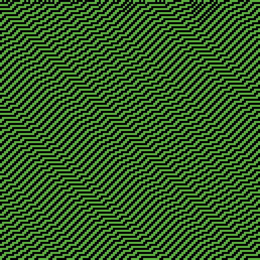</TD>

</TR>
<TR>
<TH> Règle &#8470;12</TH>
<TD></TD>
<TD>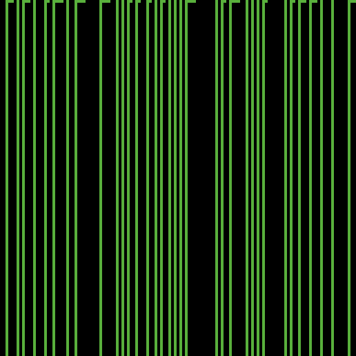</TD>

</TR>
<TR>
<TH> Règle &#8470;13</TH>
<TD>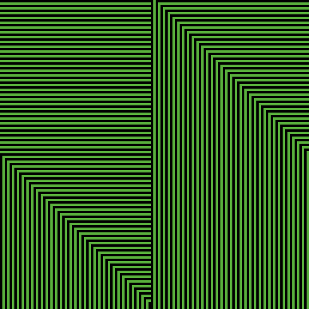</TD>
<TD></TD>

</TR>
<TR>
<TH> Règle &#8470;14</TH>
<TD></TD>
<TD></TD>

</TR>
<TR>
<TH> Règle &#8470;15</TH>
<TD></TD>
<TD></TD>

</TR>
<TR>
<TH> Règle &#8470;16</TH>
<TD></TD>
<TD></TD>

</TR>
<TR>
<TH> Règle &#8470;17</TH>
<TD></TD>
<TD>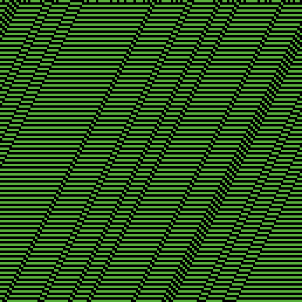</TD>

</TR>
<TR>
<TH> Règle &#8470;18</TH>
<TD></TD>
<TD>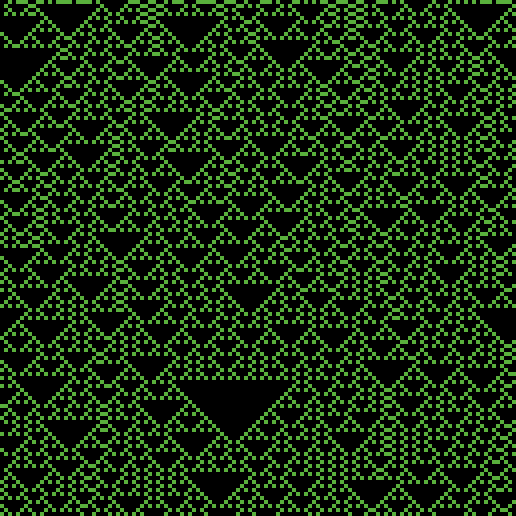</TD>

</TR>
<TR>
<TH> Règle &#8470;19</TH>
<TD></TD>
<TD></TD>

</TR>
<TR>
<TH> Règle &#8470;20</TH>
<TD></TD>
<TD></TD>

</TR>
<TR>
<TH> Règle &#8470;21</TH>
<TD></TD>
<TD>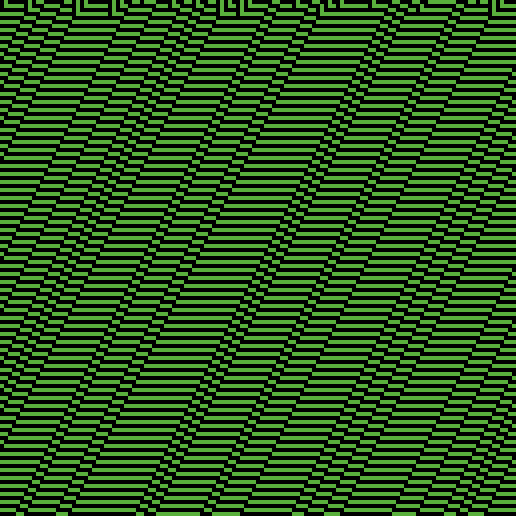</TD>

</TR>
<TR>
<TH> Règle &#8470;22</TH>
<TD>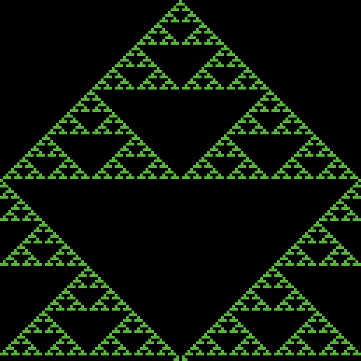</TD>
<TD></TD>

</TR>
<TR>
<TH> Règle &#8470;23</TH>
<TD></TD>
<TD>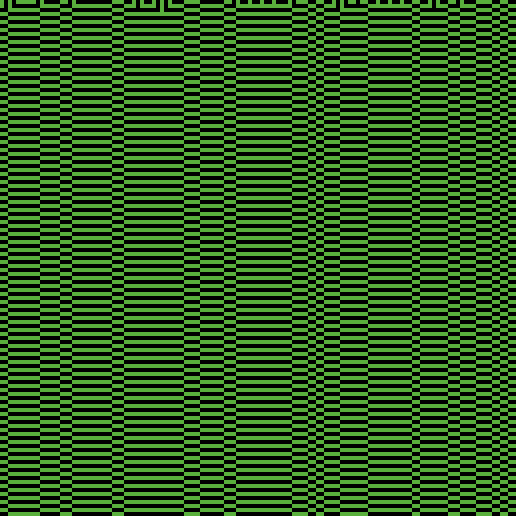</TD>

</TR>
<TR>
<TH> Règle &#8470;24</TH>
<TD></TD>
<TD>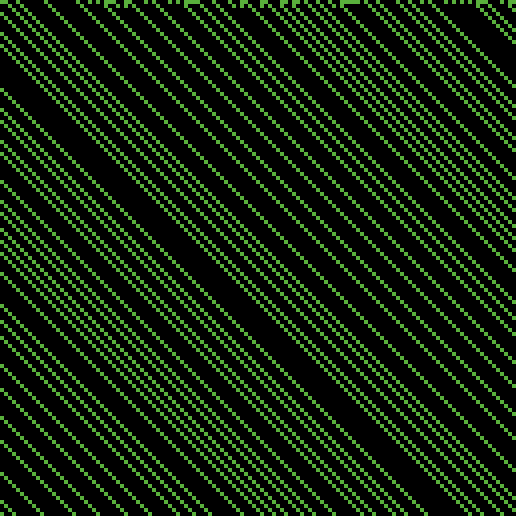</TD>

</TR>
<TR>
<TH> Règle &#8470;25</TH>
<TD></TD>
<TD></TD>

</TR>
<TR>
<TH> Règle &#8470;26</TH>
<TD>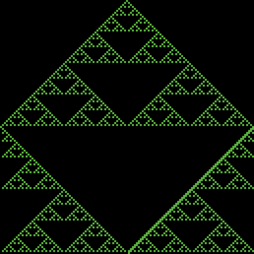</TD>
<TD>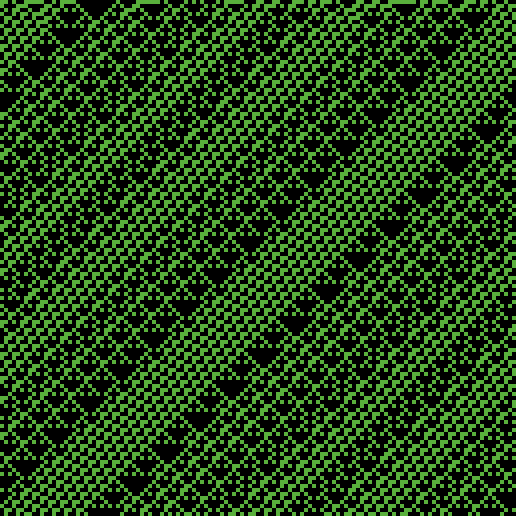</TD>

</TR>
<TR>
<TH> Règle &#8470;27</TH>
<TD></TD>
<TD></TD>

</TR>
<TR>
<TH> Règle &#8470;28</TH>
<TD></TD>
<TD></TD>

</TR>
<TR>
<TH> Règle &#8470;29</TH>
<TD>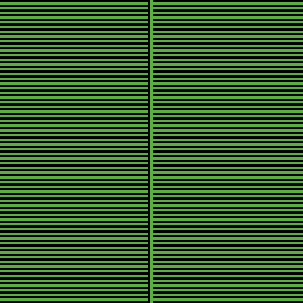</TD>
<TD></TD>

</TR>
<TR>
<TH> Règle &#8470;30</TH>
<TD></TD>
<TD>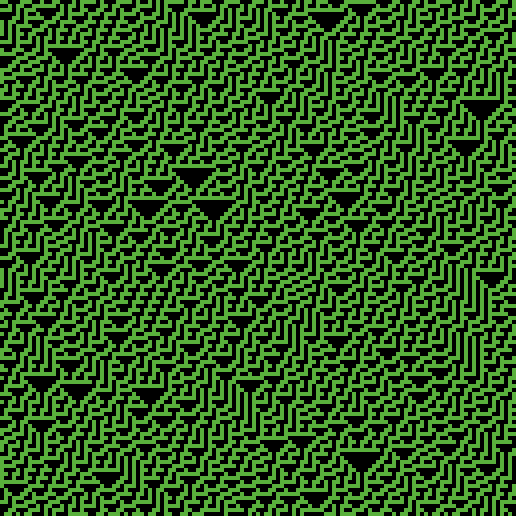</TD>

</TR>
<TR>
<TH> Règle &#8470;31</TH>
<TD></TD>
<TD>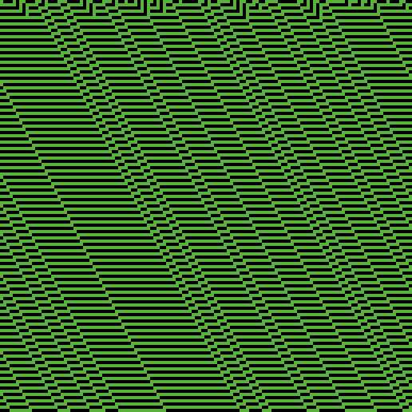</TD>

</TR>
<TR>
<TH> Règle &#8470;32</TH>
<TD></TD>
<TD></TD>

</TR>
<TR>
<TH> Règle &#8470;33</TH>
<TD>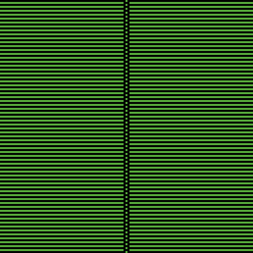</TD>
<TD></TD>

</TR>
<TR>
<TH> Règle &#8470;34</TH>
<TD></TD>
<TD></TD>

</TR>
<TR>
<TH> Règle &#8470;35</TH>
<TD></TD>
<TD>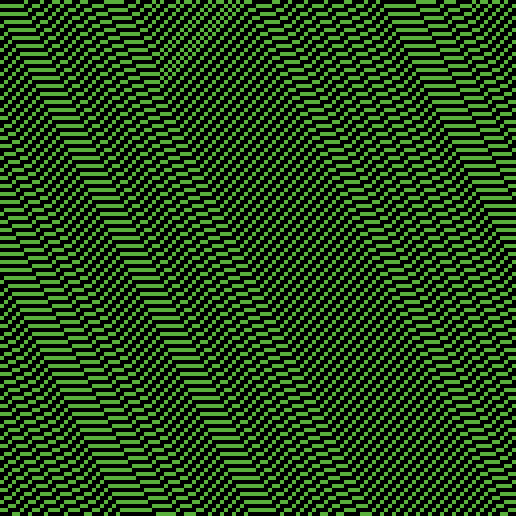</TD>

</TR>
<TR>
<TH> Règle &#8470;36</TH>
<TD></TD>
<TD>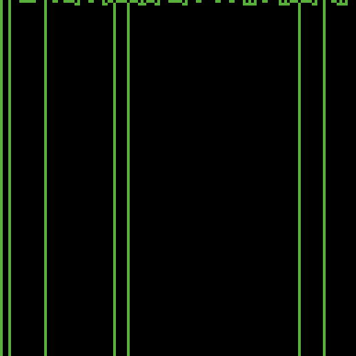</TD>

</TR>
<TR>
<TH> Règle &#8470;37</TH>
<TD>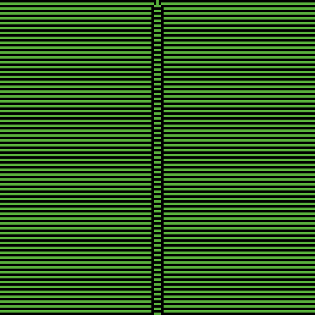</TD>
<TD>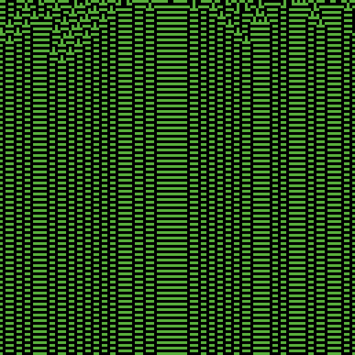</TD>

</TR>
<TR>
<TH> Règle &#8470;38</TH>
<TD></TD>
<TD>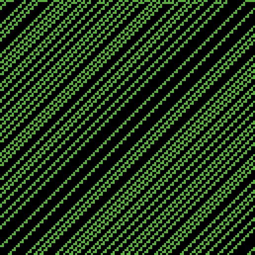</TD>

</TR>
<TR>
<TH> Règle &#8470;39</TH>
<TD></TD>
<TD></TD>

</TR>
<TR>
<TH> Règle &#8470;40</TH>
<TD></TD>
<TD></TD>

</TR>
<TR>
<TH> Règle &#8470;41</TH>
<TD>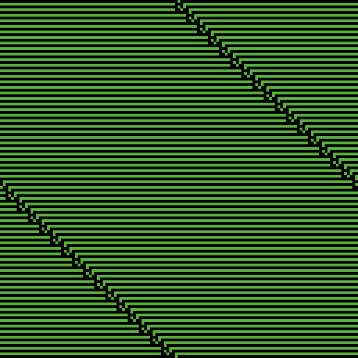</TD>
<TD></TD>

</TR>
<TR>
<TH> Règle &#8470;42</TH>
<TD></TD>
<TD></TD>

</TR>
<TR>
<TH> Règle &#8470;43</TH>
<TD></TD>
<TD>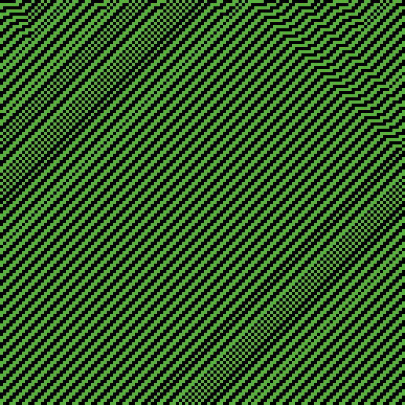</TD>

</TR>
<TR>
<TH> Règle &#8470;44</TH>
<TD></TD>
<TD>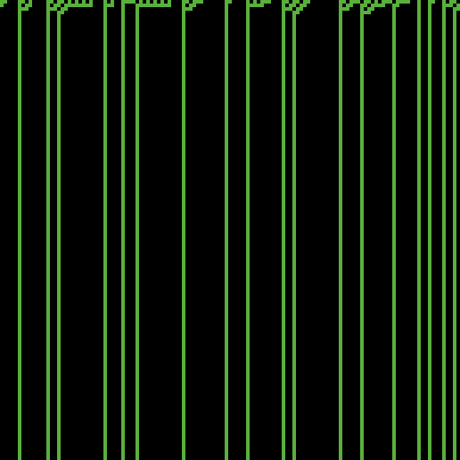</TD>

</TR>
<TR>
<TH> Règle &#8470;45</TH>
<TD></TD>
<TD></TD>

</TR>
<TR>
<TH> Règle &#8470;46</TH>
<TD></TD>
<TD></TD>

</TR>
<TR>
<TH> Règle &#8470;47</TH>
<TD></TD>
<TD></TD>

</TR>
<TR>
<TH> Règle &#8470;48</TH>
<TD></TD>
<TD>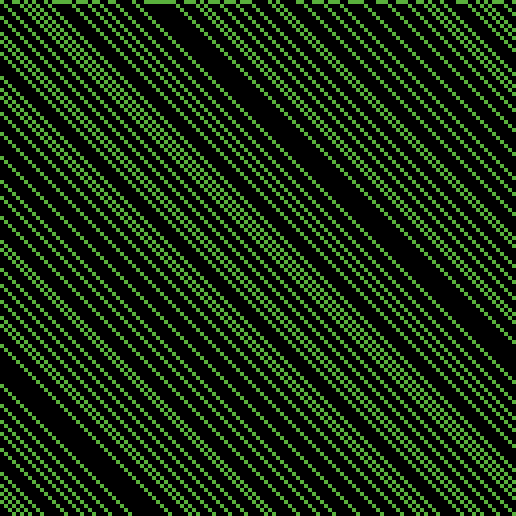</TD>

</TR>
<TR>
<TH> Règle &#8470;49</TH>
<TD></TD>
<TD></TD>

</TR>
<TR>
<TH> Règle &#8470;50</TH>
<TD></TD>
<TD></TD>

</TR>
<TR>
<TH> Règle &#8470;51</TH>
<TD></TD>
<TD></TD>

</TR>
<TR>
<TH> Règle &#8470;52</TH>
<TD></TD>
<TD></TD>

</TR>
<TR>
<TH> Règle &#8470;53</TH>
<TD>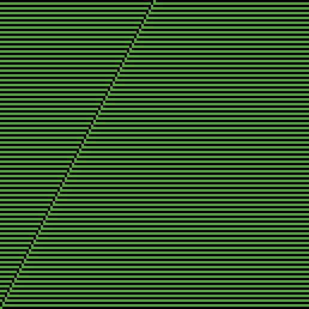</TD>
<TD></TD>

</TR>
<TR>
<TH> Règle &#8470;54</TH>
<TD></TD>
<TD></TD>

</TR>
<TR>
<TH> Règle &#8470;55</TH>
<TD></TD>
<TD>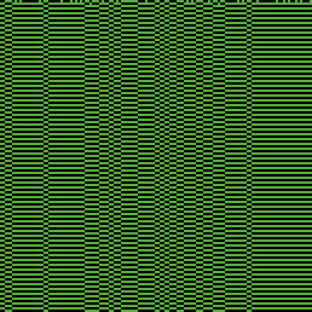</TD>

</TR>
<TR>
<TH> Règle &#8470;56</TH>
<TD></TD>
<TD></TD>

</TR>
<TR>
<TH> Règle &#8470;57</TH>
<TD></TD>
<TD></TD>

</TR>
<TR>
<TH> Règle &#8470;58</TH>
<TD></TD>
<TD></TD>

</TR>
<TR>
<TH> Règle &#8470;59</TH>
<TD>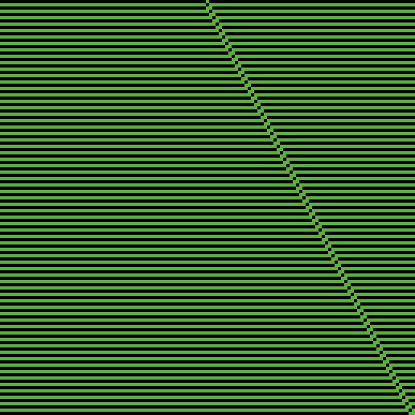</TD>
<TD></TD>

</TR>
<TR>
<TH> Règle &#8470;60</TH>
<TD>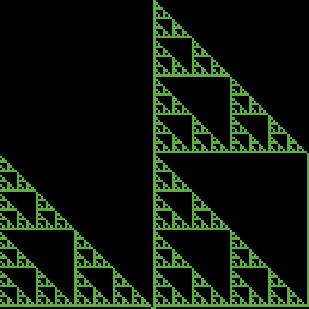</TD>
<TD></TD>

</TR>
<TR>
<TH> Règle &#8470;61</TH>
<TD>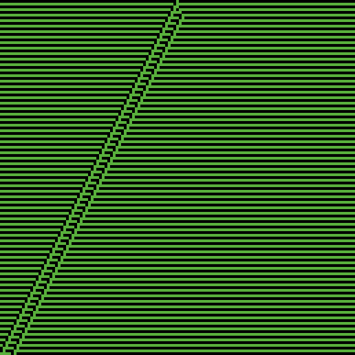</TD>
<TD>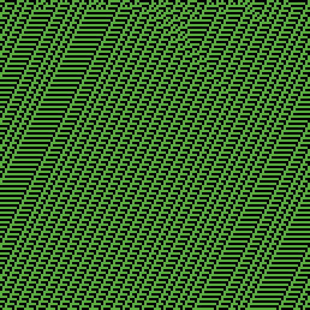</TD>

</TR>
<TR>
<TH> Règle &#8470;62</TH>
<TD></TD>
<TD>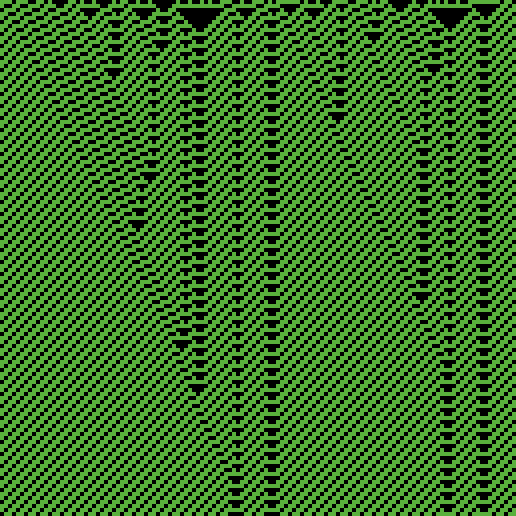</TD>

</TR>
<TR>
<TH> Règle &#8470;63</TH>
<TD></TD>
<TD></TD>

</TR>
<TR>
<TH> Règle &#8470;64</TH>
<TD></TD>
<TD></TD>

</TR>
<TR>
<TH> Règle &#8470;65</TH>
<TD></TD>
<TD></TD>

</TR>
<TR>
<TH> Règle &#8470;66</TH>
<TD></TD>
<TD>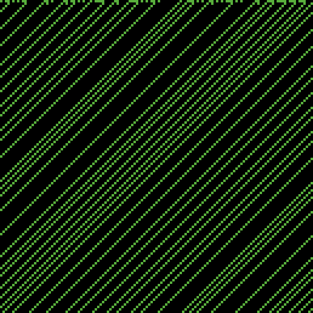</TD>

</TR>
<TR>
<TH> Règle &#8470;67</TH>
<TD></TD>
<TD></TD>

</TR>
<TR>
<TH> Règle &#8470;68</TH>
<TD></TD>
<TD>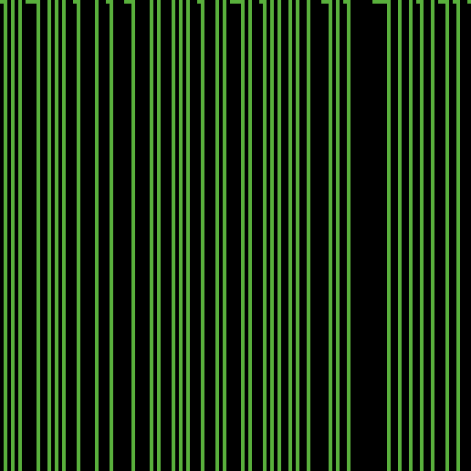</TD>

</TR>
<TR>
<TH> Règle &#8470;69</TH>
<TD>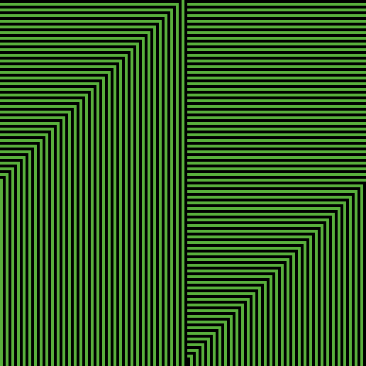</TD>
<TD></TD>

</TR>
<TR>
<TH> Règle &#8470;70</TH>
<TD></TD>
<TD></TD>

</TR>
<TR>
<TH> Règle &#8470;71</TH>
<TD></TD>
<TD>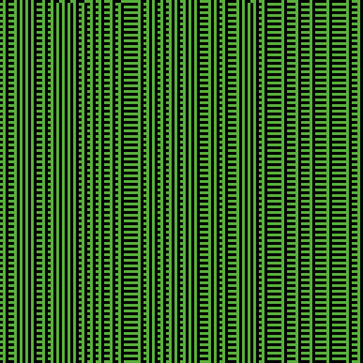</TD>

</TR>
<TR>
<TH> Règle &#8470;72</TH>
<TD></TD>
<TD>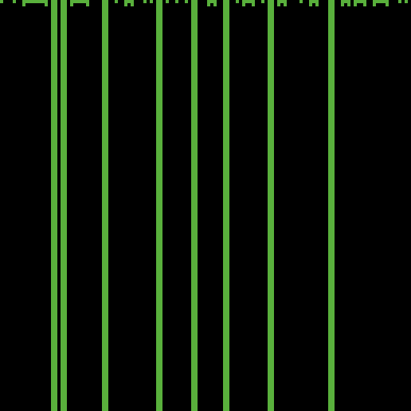</TD>

</TR>
<TR>
<TH> Règle &#8470;73</TH>
<TD></TD>
<TD></TD>

</TR>
<TR>
<TH> Règle &#8470;74</TH>
<TD></TD>
<TD></TD>

</TR>
<TR>
<TH> Règle &#8470;75</TH>
<TD>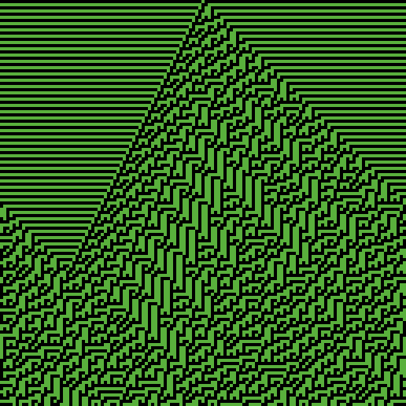</TD>
<TD></TD>

</TR>
<TR>
<TH> Règle &#8470;76</TH>
<TD></TD>
<TD></TD>

</TR>
<TR>
<TH> Règle &#8470;77</TH>
<TD>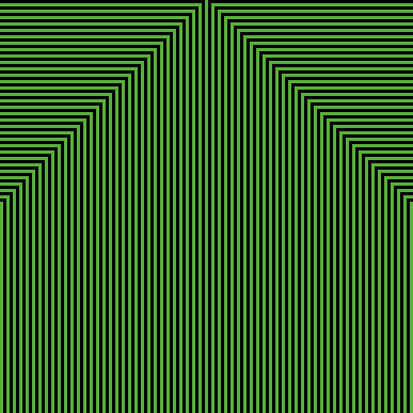</TD>
<TD>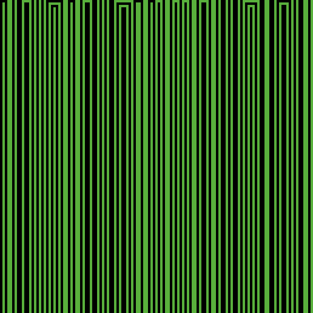</TD>

</TR>
<TR>
<TH> Règle &#8470;78</TH>
<TD></TD>
<TD></TD>

</TR>
<TR>
<TH> Règle &#8470;79</TH>
<TD>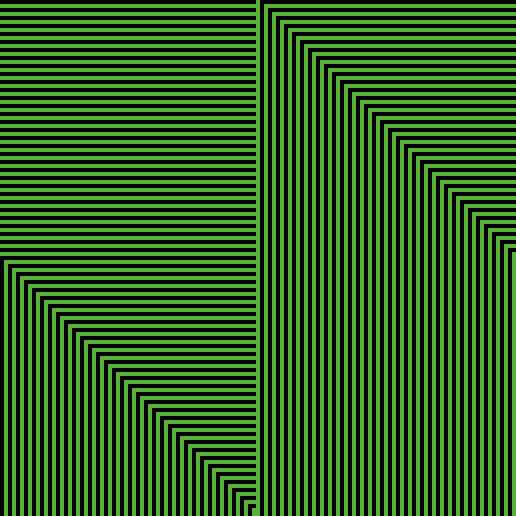</TD>
<TD></TD>

</TR>
<TR>
<TH> Règle &#8470;80</TH>
<TD></TD>
<TD></TD>

</TR>
<TR>
<TH> Règle &#8470;81</TH>
<TD>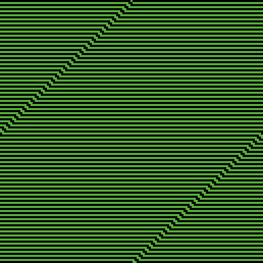</TD>
<TD></TD>

</TR>
<TR>
<TH> Règle &#8470;82</TH>
<TD></TD>
<TD>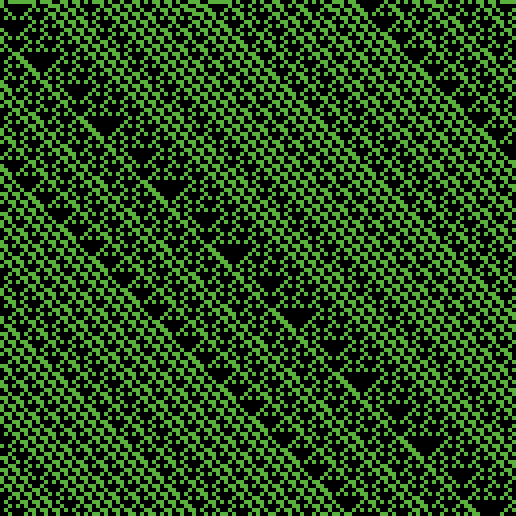</TD>

</TR>
<TR>
<TH> Règle &#8470;83</TH>
<TD>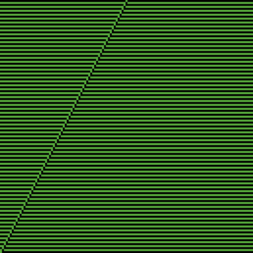</TD>
<TD></TD>

</TR>
<TR>
<TH> Règle &#8470;84</TH>
<TD></TD>
<TD>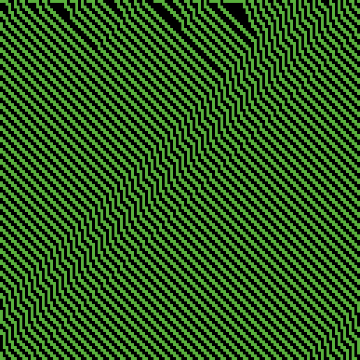</TD>

</TR>
<TR>
<TH> Règle &#8470;85</TH>
<TD>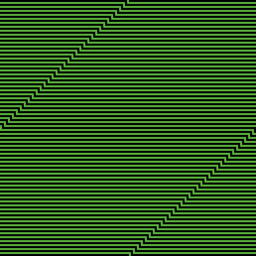</TD>
<TD>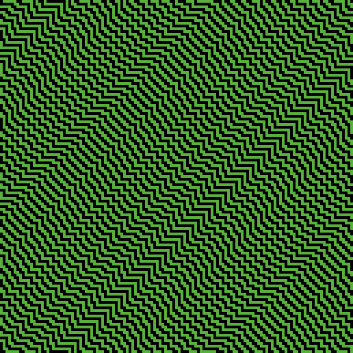</TD>

</TR>
<TR>
<TH> Règle &#8470;86</TH>
<TD></TD>
<TD>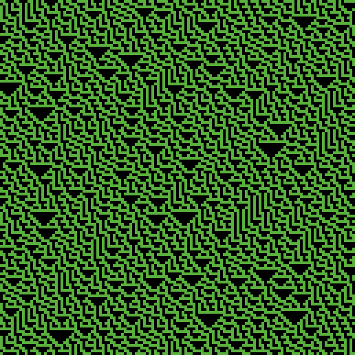</TD>

</TR>
<TR>
<TH> Règle &#8470;87</TH>
<TD></TD>
<TD></TD>

</TR>
<TR>
<TH> Règle &#8470;88</TH>
<TD></TD>
<TD></TD>

</TR>
<TR>
<TH> Règle &#8470;89</TH>
<TD>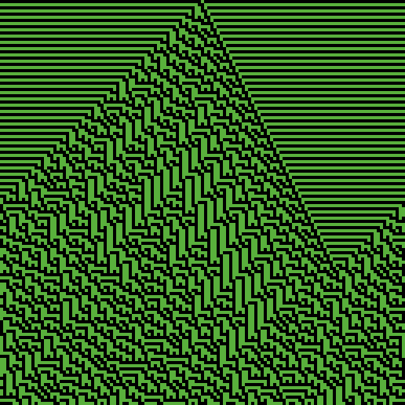</TD>
<TD></TD>

</TR>
<TR>
<TH> Règle &#8470;90</TH>
<TD></TD>
<TD></TD>

</TR>
<TR>
<TH> Règle &#8470;91</TH>
<TD>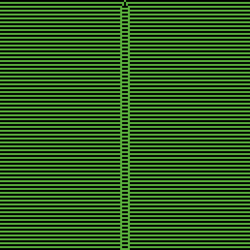</TD>
<TD></TD>

</TR>
<TR>
<TH> Règle &#8470;92</TH>
<TD></TD>
<TD></TD>

</TR>
<TR>
<TH> Règle &#8470;93</TH>
<TD></TD>
<TD>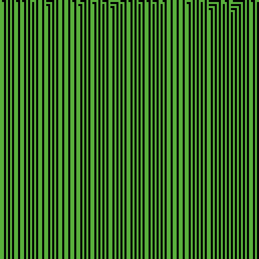</TD>

</TR>
<TR>
<TH> Règle &#8470;94</TH>
<TD>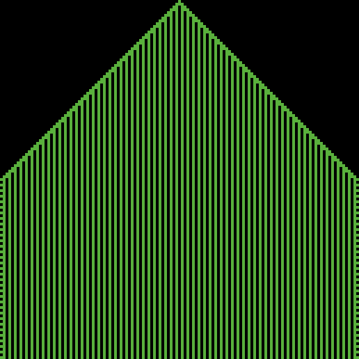</TD>
<TD>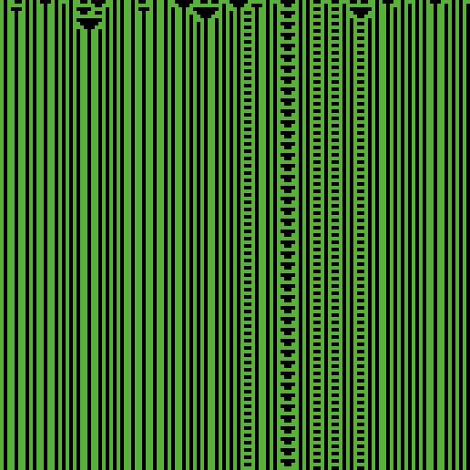</TD>

</TR>
<TR>
<TH> Règle &#8470;95</TH>
<TD></TD>
<TD></TD>

</TR>
<TR>
<TH> Règle &#8470;96</TH>
<TD></TD>
<TD></TD>

</TR>
<TR>
<TH> Règle &#8470;97</TH>
<TD></TD>
<TD>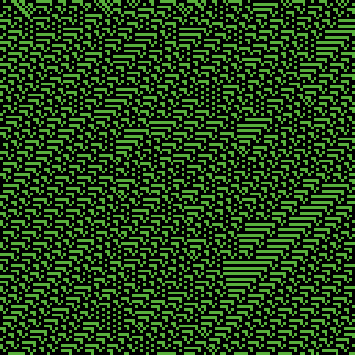</TD>

</TR>
<TR>
<TH> Règle &#8470;98</TH>
<TD></TD>
<TD>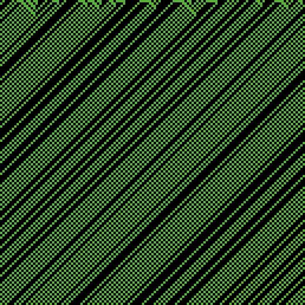</TD>

</TR>
<TR>
<TH> Règle &#8470;99</TH>
<TD>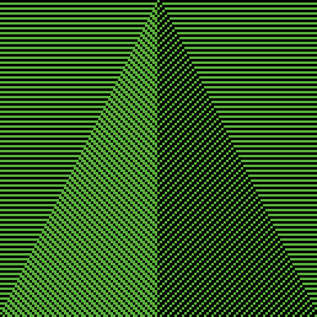</TD>
<TD>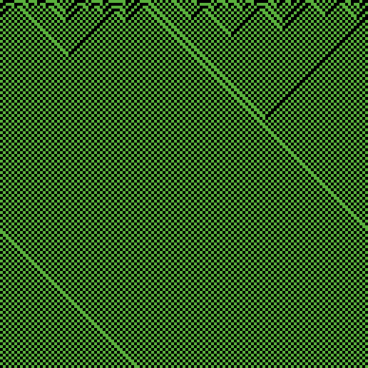</TD>

</TR>
<TR>
<TH> Règle &#8470;100</TH>
<TD></TD>
<TD>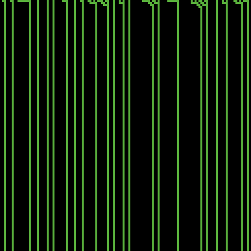</TD>

</TR>
<TR>
<TH> Règle &#8470;101</TH>
<TD></TD>
<TD>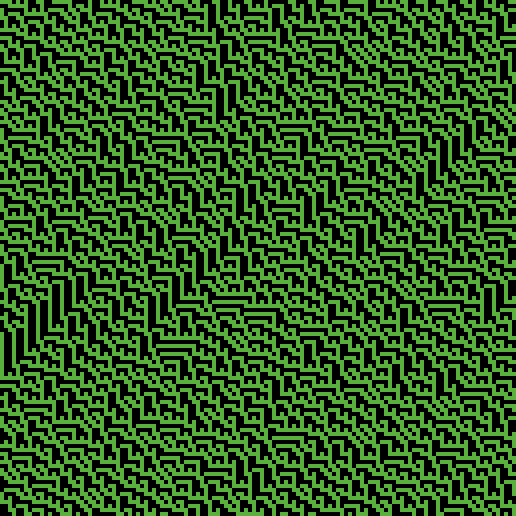</TD>

</TR>
<TR>
<TH> Règle &#8470;102</TH>
<TD>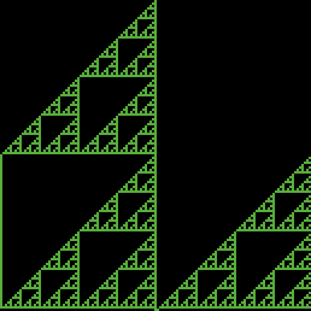</TD>
<TD>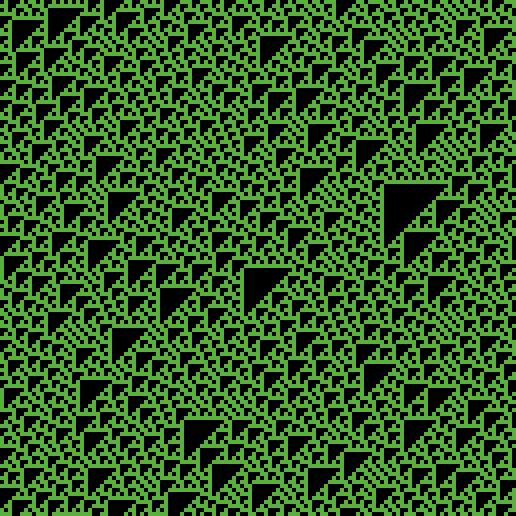</TD>

</TR>
<TR>
<TH> Règle &#8470;103</TH>
<TD>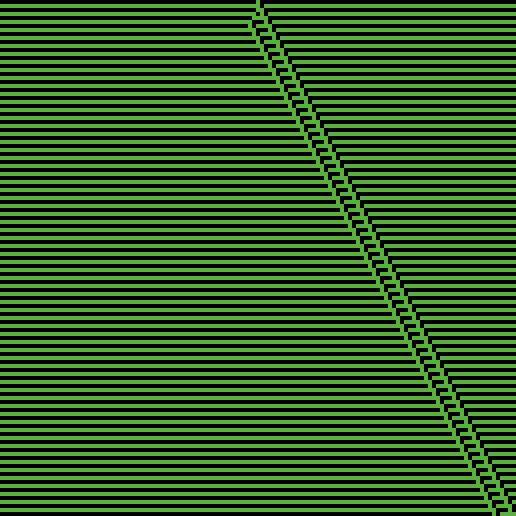</TD>
<TD></TD>

</TR>
<TR>
<TH> Règle &#8470;104</TH>
<TD></TD>
<TD></TD>

</TR>
<TR>
<TH> Règle &#8470;105</TH>
<TD></TD>
<TD></TD>

</TR>
<TR>
<TH> Règle &#8470;106</TH>
<TD></TD>
<TD></TD>

</TR>
<TR>
<TH> Règle &#8470;107</TH>
<TD></TD>
<TD></TD>

</TR>
<TR>
<TH> Règle &#8470;108</TH>
<TD></TD>
<TD>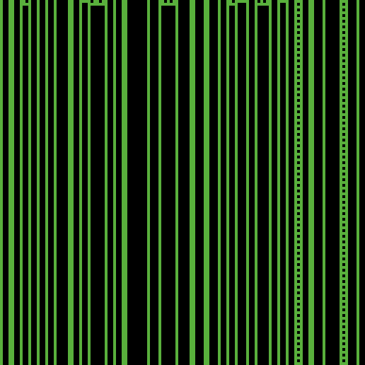</TD>

</TR>
<TR>
<TH> Règle &#8470;109</TH>
<TD></TD>
<TD></TD>

</TR>
<TR>
<TH> Règle &#8470;110</TH>
<TD>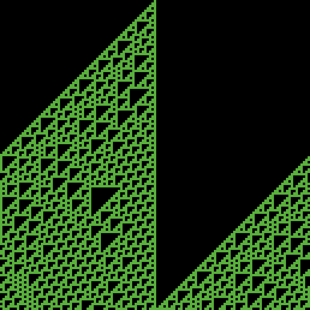</TD>
<TD>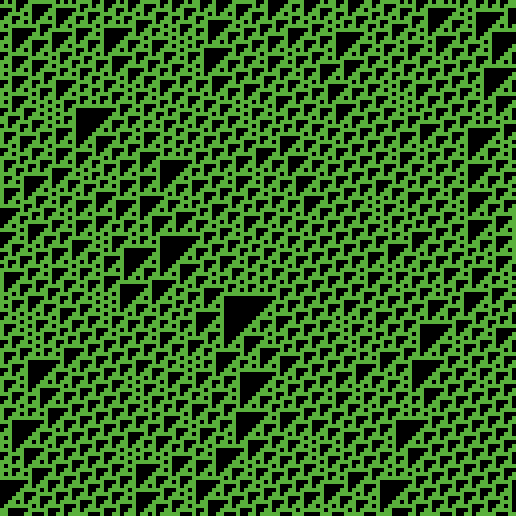</TD>

</TR>
<TR>
<TH> Règle &#8470;111</TH>
<TD></TD>
<TD>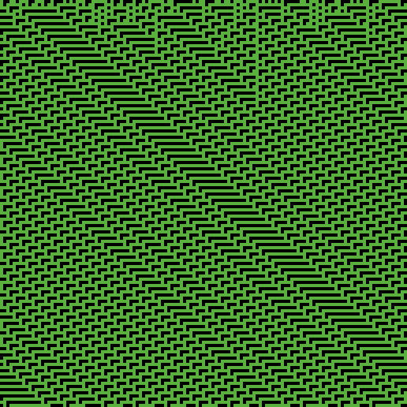</TD>

</TR>
<TR>
<TH> Règle &#8470;112</TH>
<TD></TD>
<TD>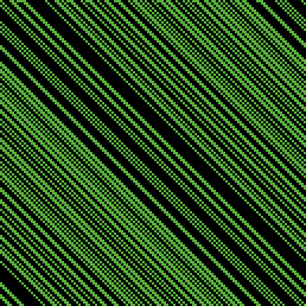</TD>

</TR>
<TR>
<TH> Règle &#8470;113</TH>
<TD></TD>
<TD>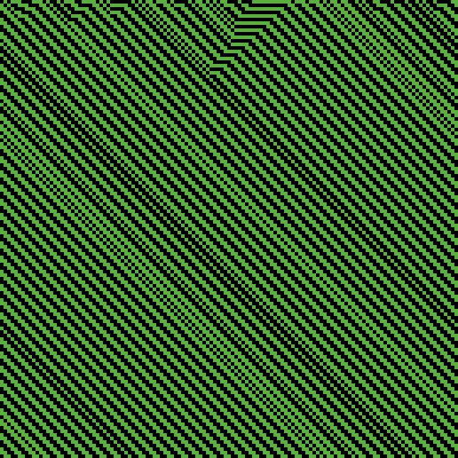</TD>

</TR>
<TR>
<TH> Règle &#8470;114</TH>
<TD></TD>
<TD>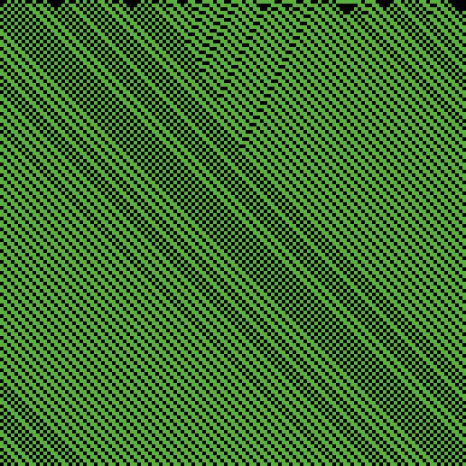</TD>

</TR>
<TR>
<TH> Règle &#8470;115</TH>
<TD>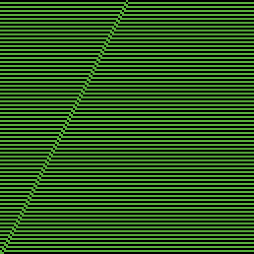</TD>
<TD></TD>

</TR>
<TR>
<TH> Règle &#8470;116</TH>
<TD></TD>
<TD>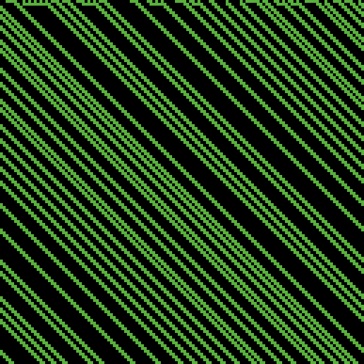</TD>

</TR>
<TR>
<TH> Règle &#8470;117</TH>
<TD></TD>
<TD></TD>

</TR>
<TR>
<TH> Règle &#8470;118</TH>
<TD></TD>
<TD>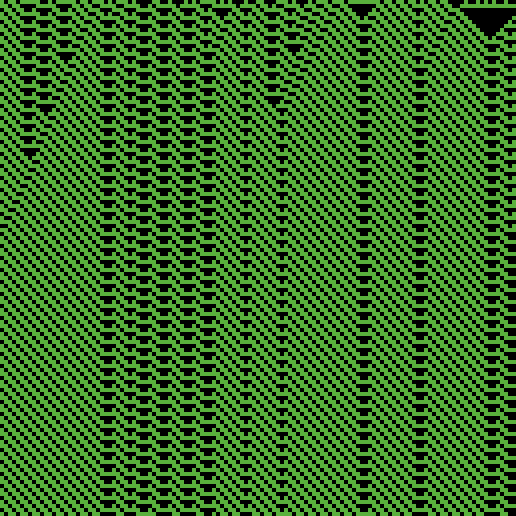</TD>

</TR>
<TR>
<TH> Règle &#8470;119</TH>
<TD></TD>
<TD></TD>

</TR>
<TR>
<TH> Règle &#8470;120</TH>
<TD></TD>
<TD></TD>

</TR>
<TR>
<TH> Règle &#8470;121</TH>
<TD>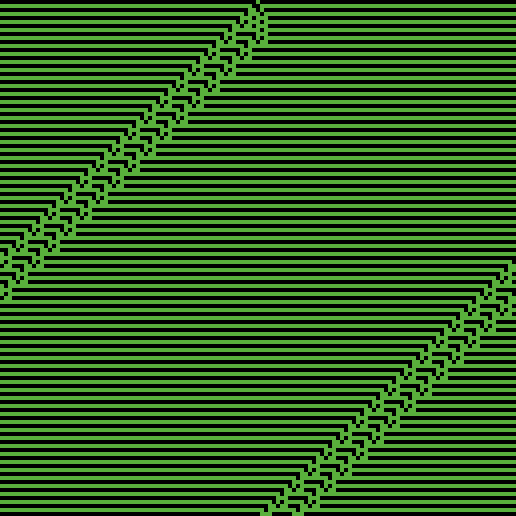</TD>
<TD></TD>

</TR>
<TR>
<TH> Règle &#8470;122</TH>
<TD>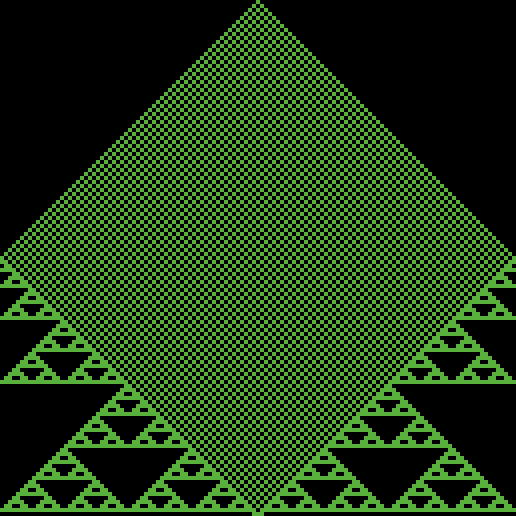</TD>
<TD></TD>

</TR>
<TR>
<TH> Règle &#8470;123</TH>
<TD></TD>
<TD></TD>

</TR>
<TR>
<TH> Règle &#8470;124</TH>
<TD></TD>
<TD></TD>

</TR>
<TR>
<TH> Règle &#8470;125</TH>
<TD></TD>
<TD></TD>

</TR>
<TR>
<TH> Règle &#8470;126</TH>
<TD>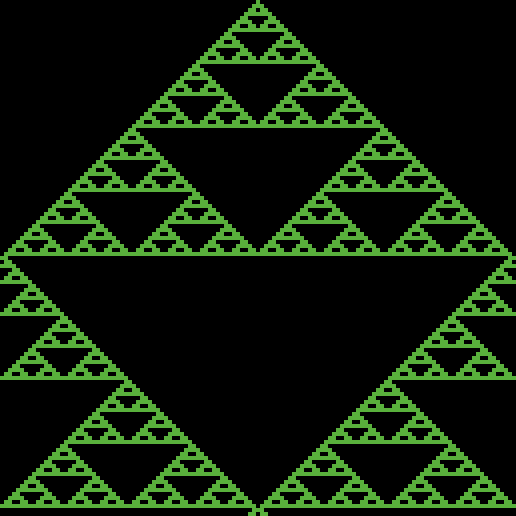</TD>
<TD>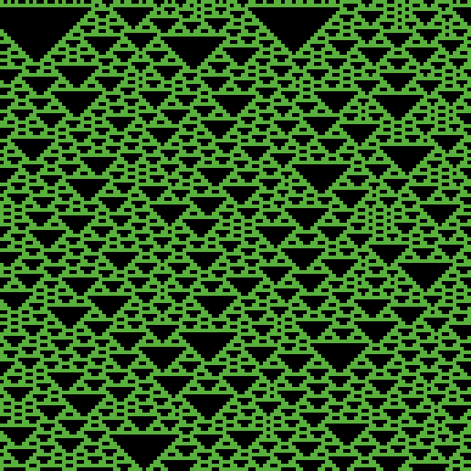</TD>

</TR>
<TR>
<TH> Règle &#8470;127</TH>
<TD></TD>
<TD></TD>

</TR>
<TR>
<TH> Règle &#8470;128</TH>
<TD></TD>
<TD></TD>

</TR>
<TR>
<TH> Règle &#8470;129</TH>
<TD>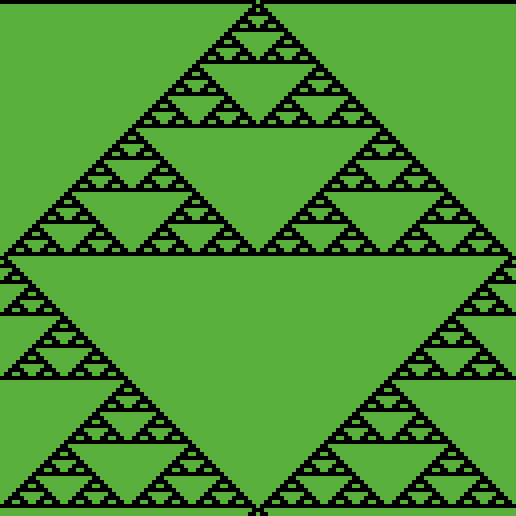</TD>
<TD>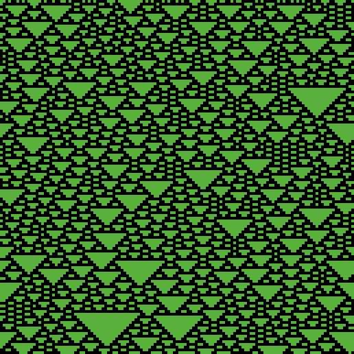</TD>

</TR>
<TR>
<TH> Règle &#8470;130</TH>
<TD></TD>
<TD>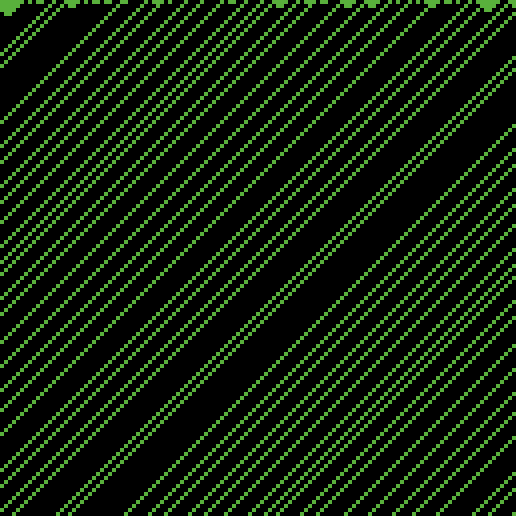</TD>

</TR>
<TR>
<TH> Règle &#8470;131</TH>
<TD></TD>
<TD></TD>

</TR>
<TR>
<TH> Règle &#8470;132</TH>
<TD></TD>
<TD>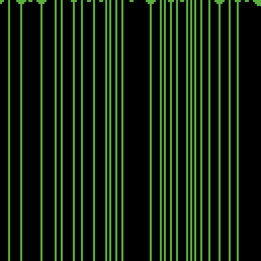</TD>

</TR>
<TR>
<TH> Règle &#8470;133</TH>
<TD>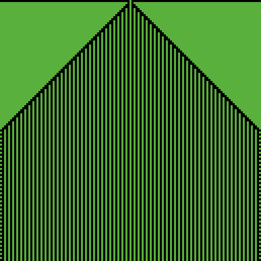</TD>
<TD></TD>

</TR>
<TR>
<TH> Règle &#8470;134</TH>
<TD></TD>
<TD>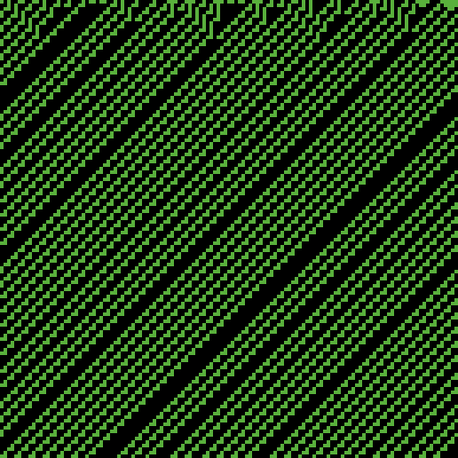</TD>

</TR>
<TR>
<TH> Règle &#8470;135</TH>
<TD></TD>
<TD>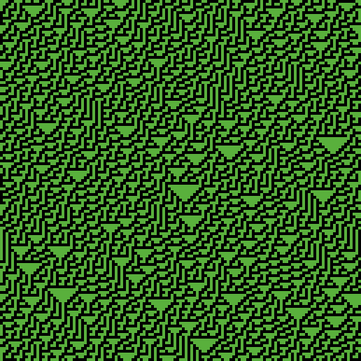</TD>

</TR>
<TR>
<TH> Règle &#8470;136</TH>
<TD></TD>
<TD></TD>

</TR>
<TR>
<TH> Règle &#8470;137</TH>
<TD></TD>
<TD></TD>

</TR>
<TR>
<TH> Règle &#8470;138</TH>
<TD></TD>
<TD></TD>

</TR>
<TR>
<TH> Règle &#8470;139</TH>
<TD></TD>
<TD>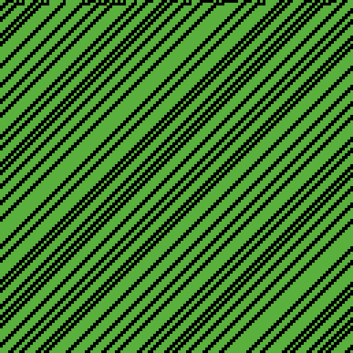</TD>

</TR>
<TR>
<TH> Règle &#8470;140</TH>
<TD></TD>
<TD></TD>

</TR>
<TR>
<TH> Règle &#8470;141</TH>
<TD></TD>
<TD></TD>

</TR>
<TR>
<TH> Règle &#8470;142</TH>
<TD></TD>
<TD></TD>

</TR>
<TR>
<TH> Règle &#8470;143</TH>
<TD></TD>
<TD></TD>

</TR>
<TR>
<TH> Règle &#8470;144</TH>
<TD></TD>
<TD>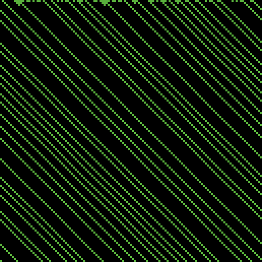</TD>

</TR>
<TR>
<TH> Règle &#8470;145</TH>
<TD></TD>
<TD>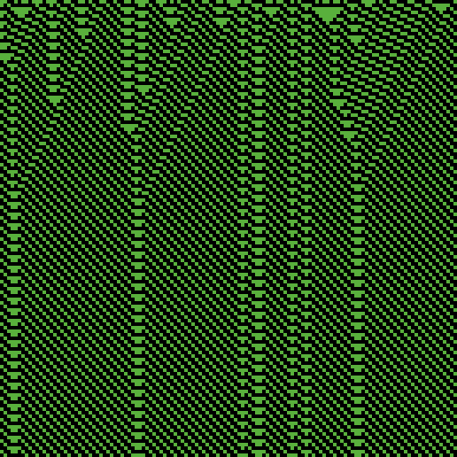</TD>

</TR>
<TR>
<TH> Règle &#8470;146</TH>
<TD></TD>
<TD>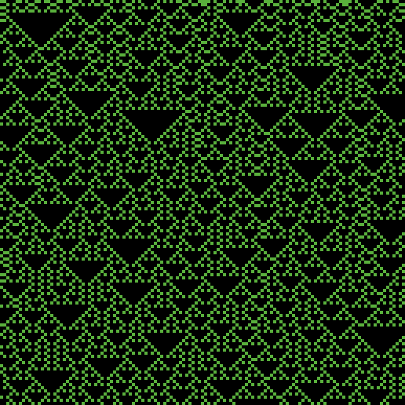</TD>

</TR>
<TR>
<TH> Règle &#8470;147</TH>
<TD>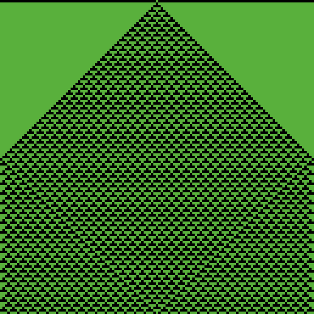</TD>
<TD></TD>

</TR>
<TR>
<TH> Règle &#8470;148</TH>
<TD></TD>
<TD></TD>

</TR>
<TR>
<TH> Règle &#8470;149</TH>
<TD>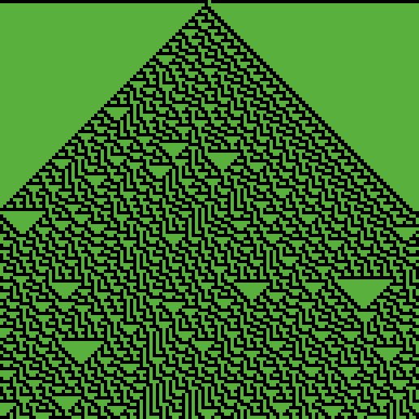</TD>
<TD></TD>

</TR>
<TR>
<TH> Règle &#8470;150</TH>
<TD>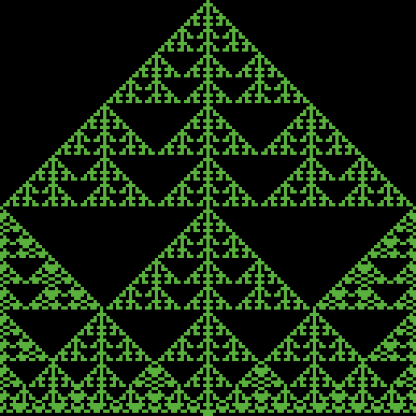</TD>
<TD></TD>

</TR>
<TR>
<TH> Règle &#8470;151</TH>
<TD></TD>
<TD>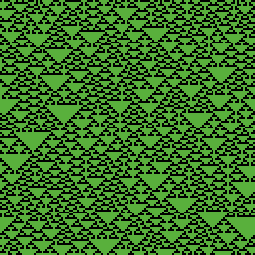</TD>

</TR>
<TR>
<TH> Règle &#8470;152</TH>
<TD></TD>
<TD>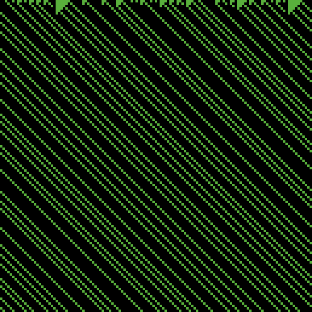</TD>

</TR>
<TR>
<TH> Règle &#8470;153</TH>
<TD>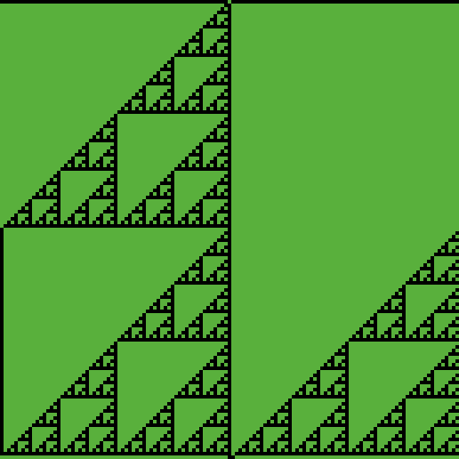</TD>
<TD></TD>

</TR>
<TR>
<TH> Règle &#8470;154</TH>
<TD></TD>
<TD></TD>

</TR>
<TR>
<TH> Règle &#8470;155</TH>
<TD></TD>
<TD></TD>

</TR>
<TR>
<TH> Règle &#8470;156</TH>
<TD></TD>
<TD></TD>

</TR>
<TR>
<TH> Règle &#8470;157</TH>
<TD></TD>
<TD>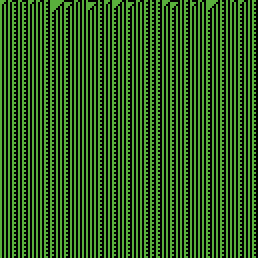</TD>

</TR>
<TR>
<TH> Règle &#8470;158</TH>
<TD>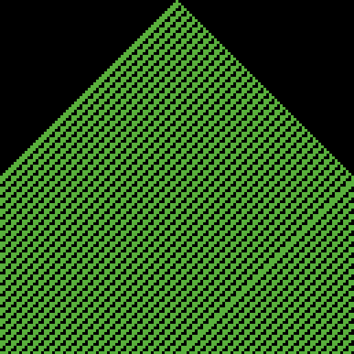</TD>
<TD></TD>

</TR>
<TR>
<TH> Règle &#8470;159</TH>
<TD></TD>
<TD></TD>

</TR>
<TR>
<TH> Règle &#8470;160</TH>
<TD></TD>
<TD></TD>

</TR>
<TR>
<TH> Règle &#8470;161</TH>
<TD></TD>
<TD>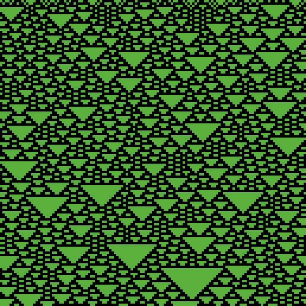</TD>

</TR>
<TR>
<TH> Règle &#8470;162</TH>
<TD></TD>
<TD></TD>

</TR>
<TR>
<TH> Règle &#8470;163</TH>
<TD>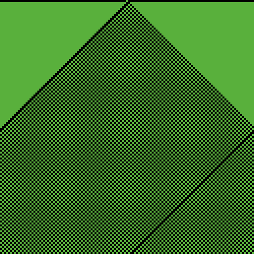</TD>
<TD>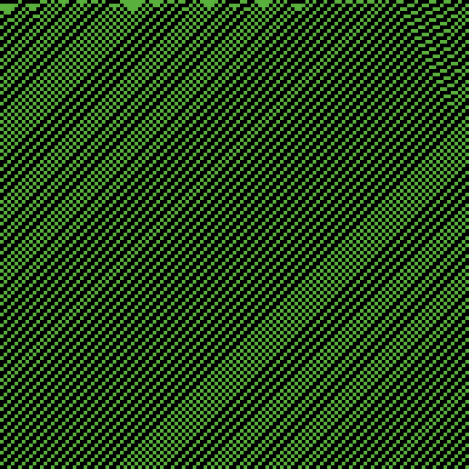</TD>

</TR>
<TR>
<TH> Règle &#8470;164</TH>
<TD></TD>
<TD></TD>

</TR>
<TR>
<TH> Règle &#8470;165</TH>
<TD>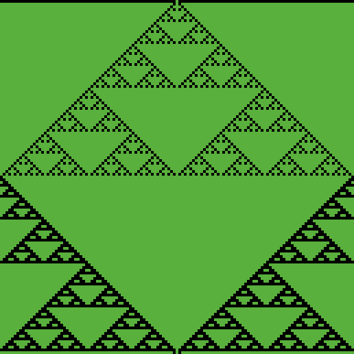</TD>
<TD>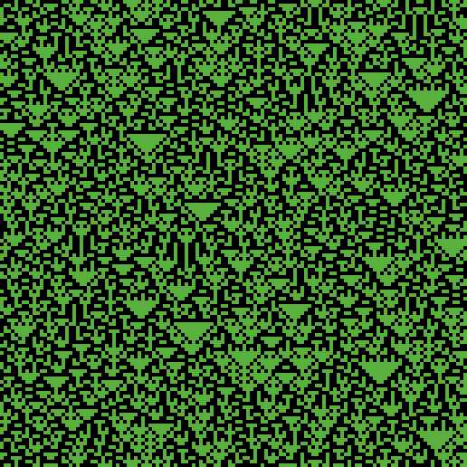</TD>

</TR>
<TR>
<TH> Règle &#8470;166</TH>
<TD></TD>
<TD>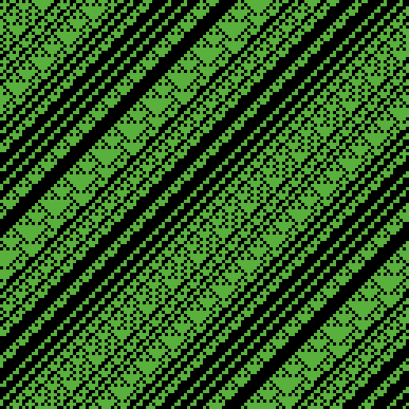</TD>

</TR>
<TR>
<TH> Règle &#8470;167</TH>
<TD></TD>
<TD>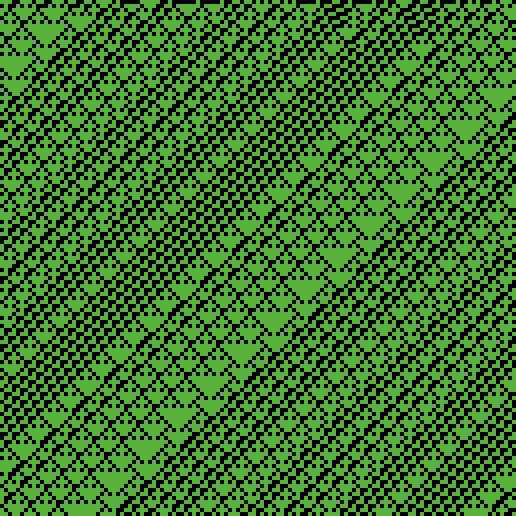</TD>

</TR>
<TR>
<TH> Règle &#8470;168</TH>
<TD></TD>
<TD></TD>

</TR>
<TR>
<TH> Règle &#8470;169</TH>
<TD></TD>
<TD>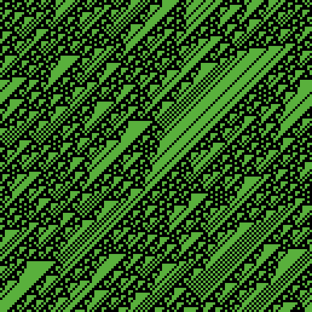</TD>

</TR>
<TR>
<TH> Règle &#8470;170</TH>
<TD></TD>
<TD>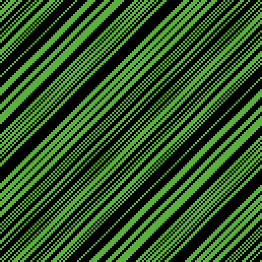</TD>

</TR>
<TR>
<TH> Règle &#8470;171</TH>
<TD></TD>
<TD></TD>

</TR>
<TR>
<TH> Règle &#8470;172</TH>
<TD></TD>
<TD>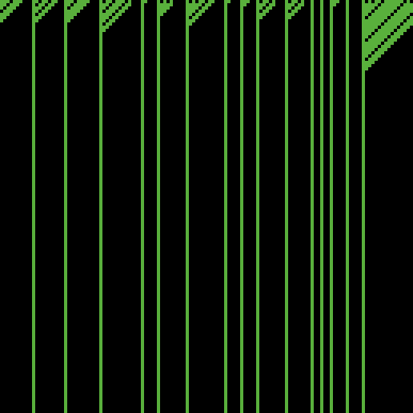</TD>

</TR>
<TR>
<TH> Règle &#8470;173</TH>
<TD></TD>
<TD></TD>

</TR>
<TR>
<TH> Règle &#8470;174</TH>
<TD></TD>
<TD></TD>

</TR>
<TR>
<TH> Règle &#8470;175</TH>
<TD></TD>
<TD></TD>

</TR>
<TR>
<TH> Règle &#8470;176</TH>
<TD></TD>
<TD>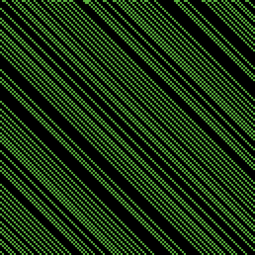</TD>

</TR>
<TR>
<TH> Règle &#8470;177</TH>
<TD>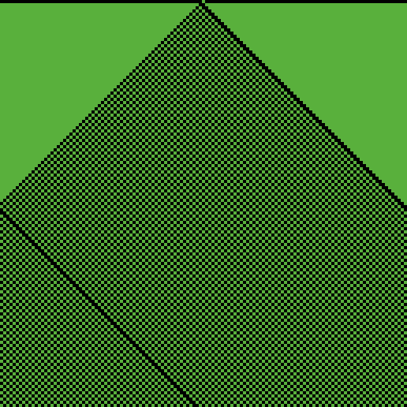</TD>
<TD></TD>

</TR>
<TR>
<TH> Règle &#8470;178</TH>
<TD></TD>
<TD>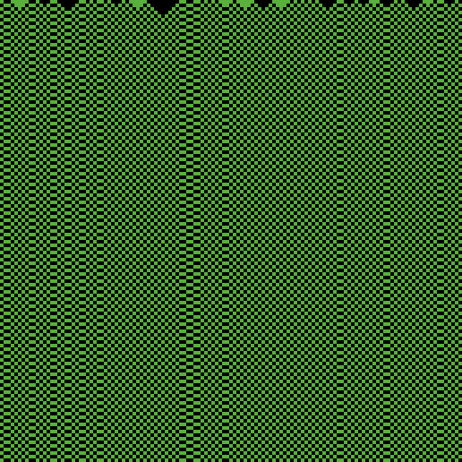</TD>

</TR>
<TR>
<TH> Règle &#8470;179</TH>
<TD>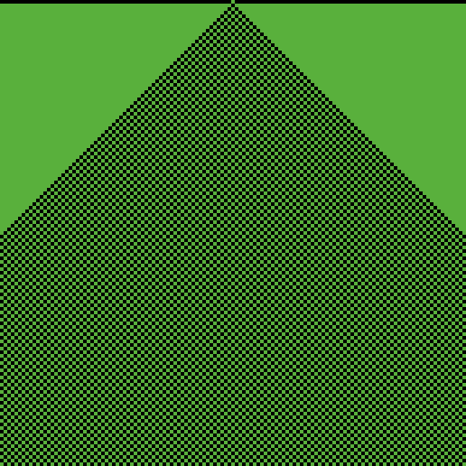</TD>
<TD>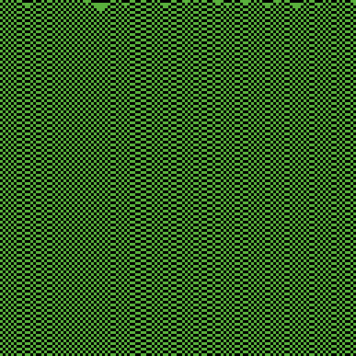</TD>

</TR>
<TR>
<TH> Règle &#8470;180</TH>
<TD></TD>
<TD>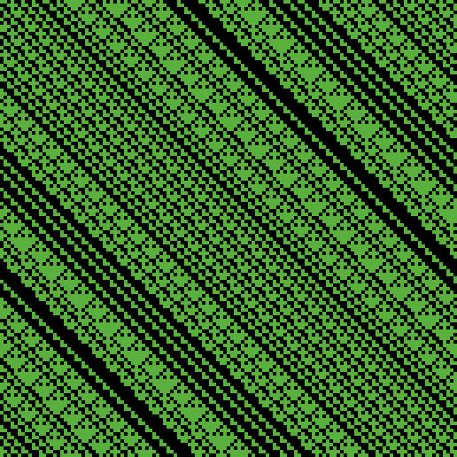</TD>

</TR>
<TR>
<TH> Règle &#8470;181</TH>
<TD></TD>
<TD></TD>

</TR>
<TR>
<TH> Règle &#8470;182</TH>
<TD>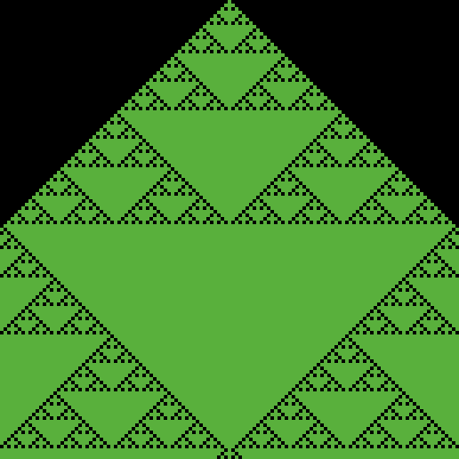</TD>
<TD>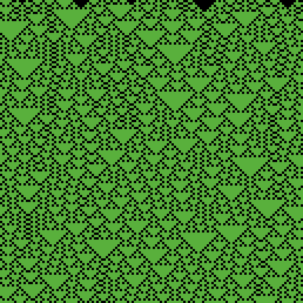</TD>

</TR>
<TR>
<TH> Règle &#8470;183</TH>
<TD></TD>
<TD></TD>

</TR>
<TR>
<TH> Règle &#8470;184</TH>
<TD></TD>
<TD></TD>

</TR>
<TR>
<TH> Règle &#8470;185</TH>
<TD></TD>
<TD></TD>

</TR>
<TR>
<TH> Règle &#8470;186</TH>
<TD></TD>
<TD></TD>

</TR>
<TR>
<TH> Règle &#8470;187</TH>
<TD></TD>
<TD></TD>

</TR>
<TR>
<TH> Règle &#8470;188</TH>
<TD>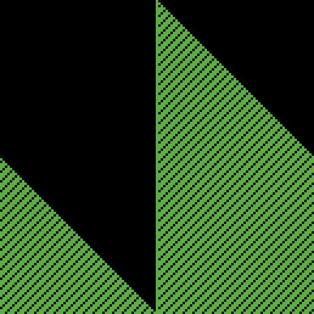</TD>
<TD></TD>

</TR>
<TR>
<TH> Règle &#8470;189</TH>
<TD></TD>
<TD></TD>

</TR>
<TR>
<TH> Règle &#8470;190</TH>
<TD></TD>
<TD></TD>

</TR>
<TR>
<TH> Règle &#8470;191</TH>
<TD></TD>
<TD></TD>

</TR>
<TR>
<TH> Règle &#8470;192</TH>
<TD></TD>
<TD></TD>

</TR>
<TR>
<TH> Règle &#8470;193</TH>
<TD></TD>
<TD>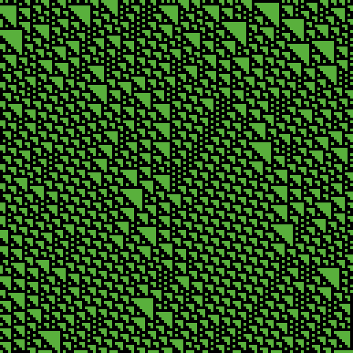</TD>

</TR>
<TR>
<TH> Règle &#8470;194</TH>
<TD></TD>
<TD>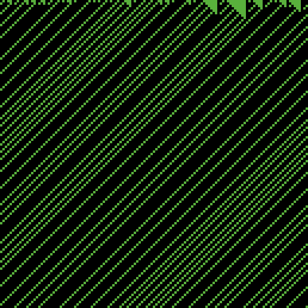</TD>

</TR>
<TR>
<TH> Règle &#8470;195</TH>
<TD></TD>
<TD>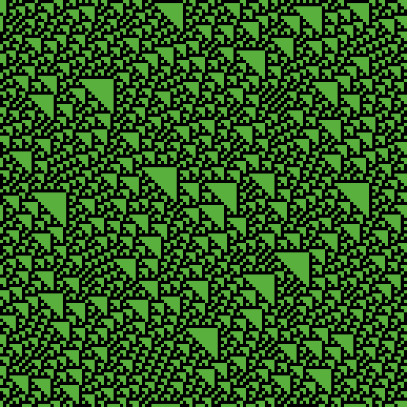</TD>

</TR>
<TR>
<TH> Règle &#8470;196</TH>
<TD></TD>
<TD></TD>

</TR>
<TR>
<TH> Règle &#8470;197</TH>
<TD></TD>
<TD></TD>

</TR>
<TR>
<TH> Règle &#8470;198</TH>
<TD></TD>
<TD>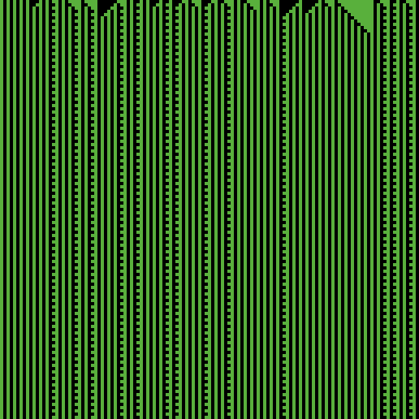</TD>

</TR>
<TR>
<TH> Règle &#8470;199</TH>
<TD></TD>
<TD></TD>

</TR>
<TR>
<TH> Règle &#8470;200</TH>
<TD></TD>
<TD>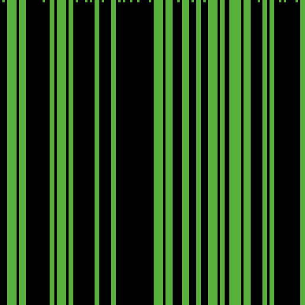</TD>

</TR>
<TR>
<TH> Règle &#8470;201</TH>
<TD></TD>
<TD></TD>

</TR>
<TR>
<TH> Règle &#8470;202</TH>
<TD></TD>
<TD></TD>

</TR>
<TR>
<TH> Règle &#8470;203</TH>
<TD></TD>
<TD></TD>

</TR>
<TR>
<TH> Règle &#8470;204</TH>
<TD></TD>
<TD>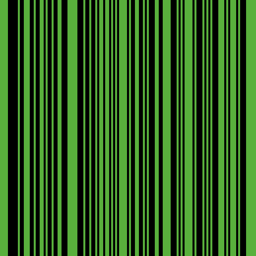</TD>

</TR>
<TR>
<TH> Règle &#8470;205</TH>
<TD></TD>
<TD>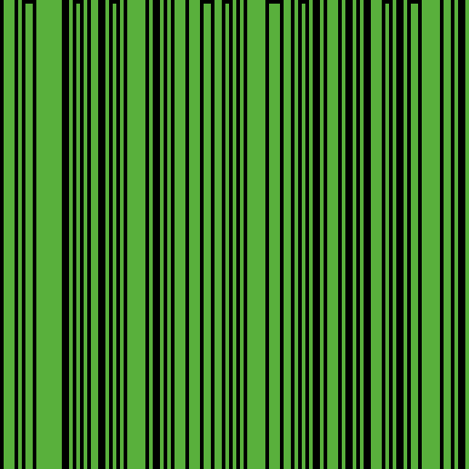</TD>

</TR>
<TR>
<TH> Règle &#8470;206</TH>
<TD></TD>
<TD></TD>

</TR>
<TR>
<TH> Règle &#8470;207</TH>
<TD></TD>
<TD></TD>

</TR>
<TR>
<TH> Règle &#8470;208</TH>
<TD></TD>
<TD></TD>

</TR>
<TR>
<TH> Règle &#8470;209</TH>
<TD></TD>
<TD>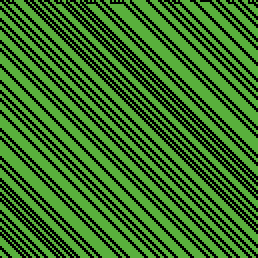</TD>

</TR>
<TR>
<TH> Règle &#8470;210</TH>
<TD>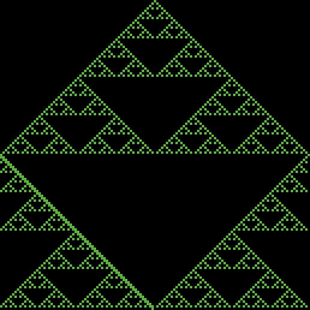</TD>
<TD></TD>

</TR>
<TR>
<TH> Règle &#8470;211</TH>
<TD></TD>
<TD></TD>

</TR>
<TR>
<TH> Règle &#8470;212</TH>
<TD></TD>
<TD></TD>

</TR>
<TR>
<TH> Règle &#8470;213</TH>
<TD></TD>
<TD></TD>

</TR>
<TR>
<TH> Règle &#8470;214</TH>
<TD>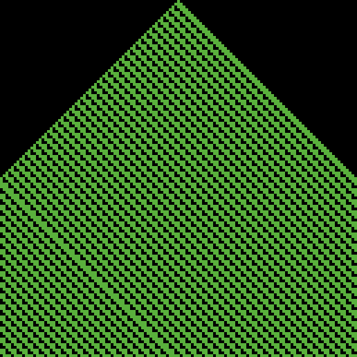</TD>
<TD></TD>

</TR>
<TR>
<TH> Règle &#8470;215</TH>
<TD></TD>
<TD>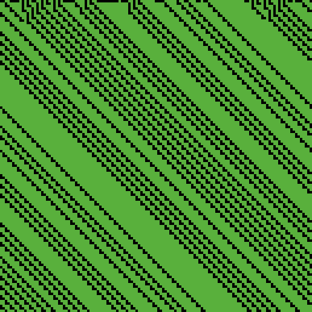</TD>

</TR>
<TR>
<TH> Règle &#8470;216</TH>
<TD></TD>
<TD></TD>

</TR>
<TR>
<TH> Règle &#8470;217</TH>
<TD></TD>
<TD>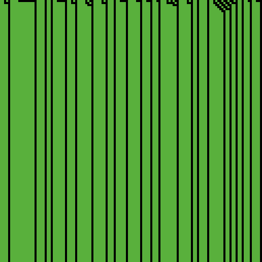</TD>

</TR>
<TR>
<TH> Règle &#8470;218</TH>
<TD></TD>
<TD></TD>

</TR>
<TR>
<TH> Règle &#8470;219</TH>
<TD></TD>
<TD></TD>

</TR>
<TR>
<TH> Règle &#8470;220</TH>
<TD></TD>
<TD></TD>

</TR>
<TR>
<TH> Règle &#8470;221</TH>
<TD></TD>
<TD></TD>

</TR>
<TR>
<TH> Règle &#8470;222</TH>
<TD></TD>
<TD></TD>

</TR>
<TR>
<TH> Règle &#8470;223</TH>
<TD></TD>
<TD></TD>

</TR>
<TR>
<TH> Règle &#8470;224</TH>
<TD></TD>
<TD></TD>

</TR>
<TR>
<TH> Règle &#8470;225</TH>
<TD></TD>
<TD></TD>

</TR>
<TR>
<TH> Règle &#8470;226</TH>
<TD></TD>
<TD>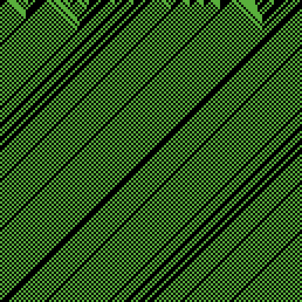</TD>

</TR>
<TR>
<TH> Règle &#8470;227</TH>
<TD></TD>
<TD></TD>

</TR>
<TR>
<TH> Règle &#8470;228</TH>
<TD></TD>
<TD></TD>

</TR>
<TR>
<TH> Règle &#8470;229</TH>
<TD></TD>
<TD></TD>

</TR>
<TR>
<TH> Règle &#8470;230</TH>
<TD></TD>
<TD>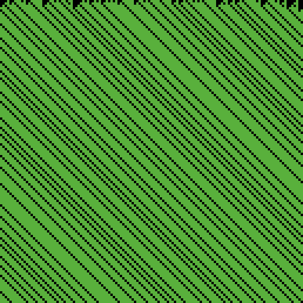</TD>

</TR>
<TR>
<TH> Règle &#8470;231</TH>
<TD></TD>
<TD>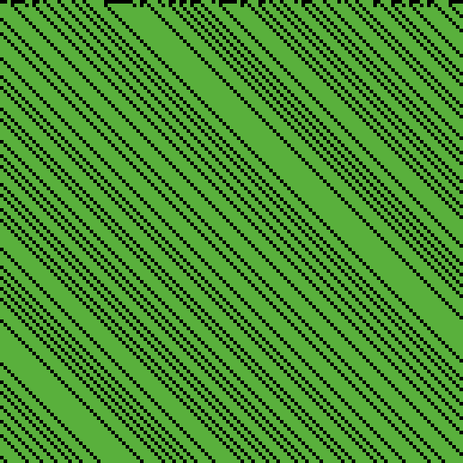</TD>

</TR>
<TR>
<TH> Règle &#8470;232</TH>
<TD></TD>
<TD></TD>

</TR>
<TR>
<TH> Règle &#8470;233</TH>
<TD></TD>
<TD></TD>

</TR>
<TR>
<TH> Règle &#8470;234</TH>
<TD></TD>
<TD></TD>

</TR>
<TR>
<TH> Règle &#8470;235</TH>
<TD></TD>
<TD></TD>

</TR>
<TR>
<TH> Règle &#8470;236</TH>
<TD></TD>
<TD>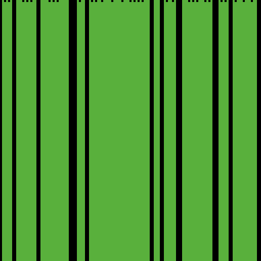</TD>

</TR>
<TR>
<TH> Règle &#8470;237</TH>
<TD></TD>
<TD></TD>

</TR>
<TR>
<TH> Règle &#8470;238</TH>
<TD></TD>
<TD></TD>

</TR>
<TR>
<TH> Règle &#8470;239</TH>
<TD></TD>
<TD></TD>

</TR>
<TR>
<TH> Règle &#8470;240</TH>
<TD></TD>
<TD>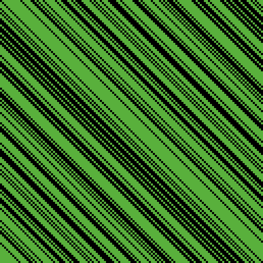</TD>

</TR>
<TR>
<TH> Règle &#8470;241</TH>
<TD></TD>
<TD>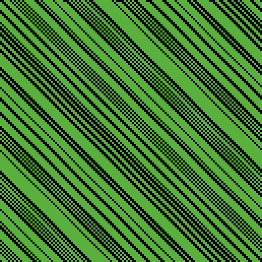</TD>

</TR>
<TR>
<TH> Règle &#8470;242</TH>
<TD></TD>
<TD></TD>

</TR>
<TR>
<TH> Règle &#8470;243</TH>
<TD></TD>
<TD></TD>

</TR>
<TR>
<TH> Règle &#8470;244</TH>
<TD></TD>
<TD>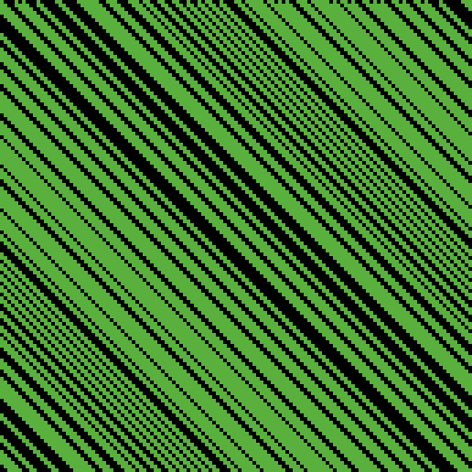</TD>

</TR>
<TR>
<TH> Règle &#8470;245</TH>
<TD></TD>
<TD>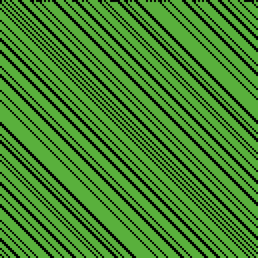</TD>

</TR>
<TR>
<TH> Règle &#8470;246</TH>
<TD></TD>
<TD></TD>

</TR>
<TR>
<TH> Règle &#8470;247</TH>
<TD></TD>
<TD></TD>

</TR>
<TR>
<TH> Règle &#8470;248</TH>
<TD></TD>
<TD></TD>

</TR>
<TR>
<TH> Règle &#8470;249</TH>
<TD></TD>
<TD></TD>

</TR>
<TR>
<TH> Règle &#8470;250</TH>
<TD></TD>
<TD></TD>

</TR>
<TR>
<TH> Règle &#8470;251</TH>
<TD></TD>
<TD></TD>

</TR>
<TR>
<TH> Règle &#8470;252</TH>
<TD></TD>
<TD></TD>

</TR>
<TR>
<TH> Règle &#8470;253</TH>
<TD></TD>
<TD></TD>

</TR>
<TR>
<TH> Règle &#8470;254</TH>
<TD></TD>
<TD></TD>

</TR>
<TR>
<TH> Règle &#8470;255</TH>
<TD></TD>
<TD></TD>

</TR>
</TABLE> 