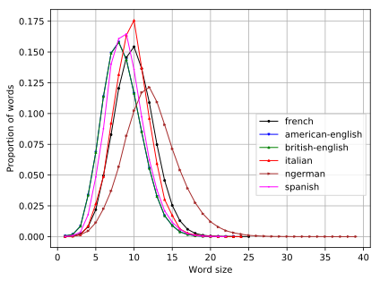

# Statistics on languages

## Word size distribution

  

## Hamming distance

|      Example 1        |       l1        |        l2       |       l3        |        l4        |
| :-------------------: | :-------------: | :-------------: | :-------------: | :--------------: | 
| String 1              |       p         |       a         |       p         |        a         |
| String 2              |       p         |       o         |       p         |        o         |
| Distance hamming (=2) |       0         |       1         |       0         |        1         |

|      Example 2          |     l1        |        l2       |       l3        |        l4        |        l5        |        l6        |
| :-------------------:   | :-----------: | :-------------: | :-------------: | :--------------: | :--------------: | :--------------: |
| String 1 (s1)                      |      p  |       a |       p         |        i         |        e         |        r         |
| String 2 (s2.1)                    |      p  |       i |       e         |        ͜          |        ͜          |        ͜          |
| Distance hamming (s1 and s2.1 =5)   |      0  |       1 |       1         |        1         |        1         |        1         |
| String 2 (s2.2)                    |      ͜   |       p |       i         |        e         |        ͜          |        ͜          |
| Distance hamming (s1 and s2.2 =6)   |      1  |       1 |       1         |        1         |        1         |        1         |
| String 2 (s2.3)                    |      ͜   |       ͜  |       p         |        i         |        e         |        ͜          |
| Distance hamming (s1 and s2.3 =3)   |      1  |       1 |       0         |        0         |        0         |        1         |
| String 2 (s2.4)                    |      ͜   |       ͜  |       ͜          |        p         |        i         |        e         |
| Distance hamming (s1 and s2.4 =6)   |      1  |       1 |       1         |        1         |        1         |        1         |

We consider the space character having the same value as the other characters. For example 2, the chosen hamming distance is the minimum calculate among all the possibilities, that is to say 3.

  

